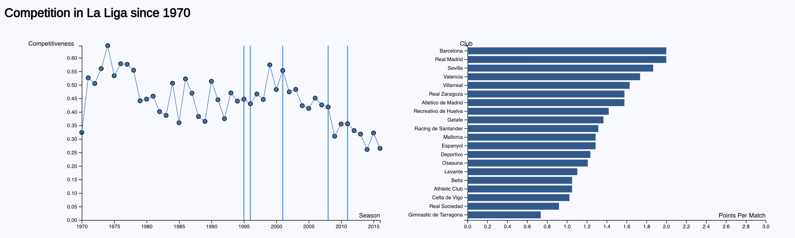

# Competitiveness in La Liga
**Authors**: Peter Xenopoulos, Stefan Cherubin

## About
In this project we investigate how competitiveness in Spain’s top soccer division, La Liga, has changed over the past 40 years. We also see how various events are visually correlated with competitiveness.

## Example Screenshot

## More
[DEMO](https://nyu-vis-fall2018.github.io/laliga-viz/.)
